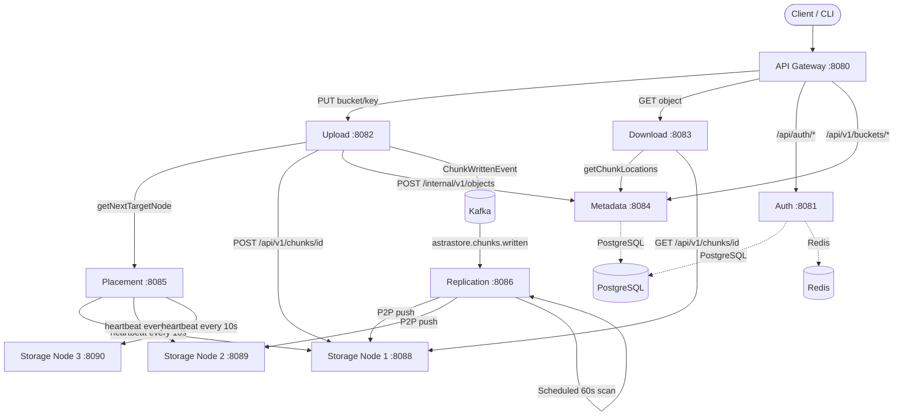

# AstraStore — Agent Context Document

> Read this file before making any changes. It is the authoritative guide for AI agents working on this codebase.

---

## 1. Project Overview

**AstraStore** is a production-grade distributed object storage system inspired by Amazon S3. It implements:

- **Zero-memory streaming** — files of any size are chunked and streamed with an 8 KB fixed buffer (O(1) memory)
- **P2P replication** — each chunk is replicated to 2 additional nodes after the primary write
- **Self-healing** — a background scanner detects under-replicated chunks and reruns the replication pipeline
- **Full observability** — Prometheus metrics, Grafana dashboards, and Jaeger distributed tracing

**Technology stack**: Java 21, Spring Boot 3.3.5, Spring Cloud Gateway, Spring Data JPA, Kafka (KRaft), PostgreSQL, Redis, Gradle multi-project build.

**Build target**: `sourceCompatibility = JavaVersion.VERSION_21`. Lombok is pinned to `1.18.40` (required for JDK 25 compatibility). Mockito `5.15.2` and ByteBuddy `1.15.11` are also force-pinned for the same reason.

---

## 2. Repository Map

```
AstraStore/                       ← repo root
├── build.gradle                  ← root build: shared dependency versions, `runAll` task
├── settings.gradle               ← declares all 11 sub-projects
├── docker-compose.yaml           ← full local stack (services + infra)
├── Dockerfile                    ← single multi-stage Dockerfile; SERVICE arg selects the module
├── gradle.properties             ← Gradle version, JVM args
│
├── api-gateway/                  ← Spring Cloud Gateway (port 8080) — routes to all services
├── auth/                         ← Auth service (port 8081) — JWT + API keys + audit log
├── upload/                       ← Upload service (port 8082) — zero-memory chunking engine
├── download/                     ← Download service (port 8083) — chunk reassembly + checksum verify
├── metadata/                     ← Metadata service (port 8084) — buckets/objects/chunks in PostgreSQL
├── placement/                    ← Placement service (port 8085) — node registry + health state machine
├── replication/                  ← Replication service (port 8086) — P2P push + self-healing scanner
├── monitoring/                   ← Monitoring service (port 8087) — exposes cluster metrics endpoint
├── storage-node/                 ← Storage node agent (port 8088) — raw chunk storage on disk
├── astrastore-shared/            ← Shared library: Kafka events, manifests, PlacementStrategy interface
├── cli/                          ← `astra` CLI tool (Picocli) — built via `./gradlew :cli:installDist`
│
├── infrastructure/
│   ├── prometheus/prometheus.yml ← Prometheus scrape config
│   └── grafana/provisioning/    ← Auto-provisioned Grafana datasources and dashboards
└── docs/                         ← Additional design documents
```

---

## 3. Services & Capabilities

### api-gateway (`:8080`)
- **Purpose**: Single entry point for all client traffic; path-based routing via Spring Cloud Gateway.
- **Routes** (from `api-gateway/src/main/resources/application.yaml`):
  - `PUT /api/v1/buckets/{bucketId}/objects/{*key}` → upload `:8082`
  - `GET|HEAD /api/v1/objects/{objectId}` → download `:8083`
  - `GET /api/v1/buckets/{bucketId}/objects/{key}` → download `:8083`
  - `DELETE /api/v1/objects/{objectId}` → metadata `:8084`
  - `POST|GET|DELETE /api/v1/buckets/**` → metadata `:8084`
  - `/api/auth/**` → auth `:8081`
  - `/api/placement/**`, `/api/replication/**`, `/api/monitoring/**` → respective services
- **No auth middleware at the gateway** — auth is handled at the auth service level.

### auth (`:8081`)
- **Purpose**: JWT access token + refresh token issuance, API key management, audit logging.
- **Entry point**: `AuthApplication.java`
- **Key classes**: `AuthController`, `ApiKeyController`, `AuditController`, `JwtService`, `RefreshTokenService`
- **Storage**: PostgreSQL (`auth` schema), Redis (refresh token store)
- **Config**: `jwt.secret` (`JWT_SECRET` env), `jwt.expiration-ms: 86400000` (24h)
- **Side effects**: All auth events produce `AuditLog` entries in PostgreSQL.

### upload (`:8082`)
- **Purpose**: Accepts multipart file uploads, streams them chunk-by-chunk to storage nodes, commits metadata.
- **Entry point**: `UploadApplication.java`
- **Critical path**: `UploadController` → `UploadOrchestrator` → `ZeroMemoryEngine` → `HttpStorageStreamClient` (to storage node) → `KafkaPublisherService` (publishes `ChunkWrittenEvent`) → `MetadataClient` (commits to `:8084`)
- **Max file size**: 5 GB (configurable via `spring.servlet.multipart.max-file-size`)
- **Kafka**: Produces to `astrastore.chunks.written` topic (auto-created by Kafka)
- **Dependencies**: placement service (node selection), metadata service (object record creation), Kafka

### download (`:8083`)
- **Purpose**: Fetches chunks from storage nodes in parallel, reassembles in order, verifies checksums.
- **Entry point**: `DownloadApplication.java`
- **Critical path**: `DownloadController` → `DownloadOrchestrator.prepare()` (fetches metadata) → `ChunkFetcher.submitAll()` (parallel CompletableFuture) → `ChunkReassembler` → `ChecksumVerifier`
- **Stream buffer**: 256 KB by default (`download.stream-buffer-kb`)
- **Dependencies**: metadata service (chunk locations)

### metadata (`:8084`)
- **Purpose**: PostgreSQL-backed catalog of buckets, objects, and chunk locations. The source of truth for the system.
- **Entry point**: `MetadataApplication.java`
- **Controllers**: `BucketController` (`/api/v1/buckets`), `ObjectController` (`/api/v1/objects`, `/internal/v1/objects`), `ChunkIndexController`
- **Schema**: `metadata` PostgreSQL schema (`ddl-auto: update`)
- **Entities**: `Bucket`, `ObjectRecord`, `ChunkLocation`
- **Important**: Object creation by Upload uses the **internal** endpoint `/internal/v1/objects` — not exposed via the API gateway.

### placement (`:8085`)
- **Purpose**: Tracks registered storage nodes, maintains live health state, and selects target nodes for upload.
- **Entry point**: `PlacementApplication.java`
- **Scheduled job**: `HeartbeatService` polls `/api/v1/health/heartbeat` on every node every 10 s (configurable: `astrastore.cluster.heartbeat.interval-ms`).
- **State machine**: `NodeHealthStateMachine` — states: `HEALTHY → DEGRADED → DOWN → RECOVERING → HEALTHY`. Failure threshold: 3 consecutive failures; recovery threshold: 2 consecutive successes.
- **Node registry**: Configured statically in `application.yaml` under `astrastore.cluster.nodes` (3 storage nodes by default).
- **API**: `PlacementController` returns the next healthy node URL for upload.

### replication (`:8086`)
- **Purpose**: Consumes `ChunkWrittenEvent` from Kafka and pushes chunks to 2 replica nodes via P2P HTTP streaming. Also runs the self-healing scanner.
- **Entry point**: `ReplicationApplication.java`
- **Kafka consumer**: `KafkaChunkListener` (group-id: `replication-service`) → `ReplicationOrchestrator.orchestrateReplication()`
- **Concurrency**: Semaphore-based, 10 concurrent streams per node (`ConcurrencyManager`)
- **Self-healing**: `UnderReplicationScanner` — `@Scheduled(fixedDelay=60000)` — queries `MockChunkDatabase`, rate-limits repairs to 2/sec (`RepairRateLimiter`), then publishes recovery events back to Kafka.
- **Known limitation**: `MockChunkDatabase` is an in-memory store. Restarting the service wipes all tracking data. See TODO comments in `UnderReplicationScanner.java` for the production replacement plan.
- **Dependencies**: metadata service (HTTP), placement service (HTTP), Kafka

### monitoring (`:8087`)
- **Purpose**: Exposes aggregated cluster health and metrics. Scraped by Prometheus.

### storage-node (`:8088`)
- **Purpose**: Dumb chunk storage agent. Writes chunks atomically to disk, serves them on demand.
- **Entry point**: `StorageNodeApplication.java`
- **Storage path**: `/data/storage/<2-hex-prefix>/<chunkId>` (256-way fan-out initialized at startup by `StorageConfig`)
- **Write strategy**: temp file → `fsync` → `Files.move(ATOMIC_MOVE)` (`AtomicFileWriter`)
- **Key endpoints** (no API gateway exposure — internal only):
  - `POST /api/v1/chunks/{id}` — store chunk
  - `GET /api/v1/chunks/{id}` — stream chunk
  - `DELETE /api/v1/chunks/{id}` — delete chunk
  - `GET /api/v1/health/heartbeat` — disk stats (polled by placement service)
  - `POST /api/v1/replication/push` — P2P push endpoint (called by replication service)
- **Stateless**: No PostgreSQL or Redis dependency.

### cli (`astra`)
- **Purpose**: Command-line client for end-to-end usage.
- **Build**: `./gradlew :cli:installDist` → binary at `cli/build/install/astra/bin/astra`
- **Config file**: `~/.astra/config.yaml` — `gatewayUrl`, `authUrl`, `placementUrl`
- **Credentials**: AES-256-GCM encrypted at `~/.astra/credentials.enc`
- **Key commands**: `auth login`, `mb`, `rb`, `ls-buckets`, `upload`, `download`, `ls`, `rm`, `cluster health`, `cluster nodes`, `cluster healing run`

### astrastore-shared
- **Purpose**: Shared library (no Spring Boot application). Contains:
  - `ChunkWrittenEvent` — Kafka message payload (record + `@Builder`)
  - `ReplicationCommand` — P2P push command
  - `ObjectManifest`, `ChunkManifest` — upload result contracts
  - `PlacementStrategy` interface — implemented by upload and replication services via `RemotePlacementStrategy`

---

## 4. Architecture & Data Flow



### Upload Flow (step-by-step)
```
Client PUT /api/v1/buckets/{bucketId}/objects/{key}
  → API Gateway (routes to Upload :8082)
  → UploadController.upload()
  → UploadOrchestrator.handleUpload()
  → ZeroMemoryEngine.process()
    → PlacementStrategy.getNextTargetNode()      (HTTP to Placement :8085)
    → HttpStorageStreamClient.openStream()       (chunked HTTP POST to Storage Node)
    → [8 KB buffer loop — reads from client, writes to node]
    → HttpStorageStreamClient.finalizeStream()   (returns checksum from node)
    → KafkaPublisherService.publishChunkWritten() (ChunkWrittenEvent → Kafka)
  → MetadataClient.createObjectRecord()          (POST /internal/v1/objects to Metadata :8084)
  → MetadataClient.recordChunkLocations()        (chunk index entries in PostgreSQL)
  → returns UploadResult (objectId, globalHash, chunks)
```

### Replication Flow
```
Kafka ChunkWrittenEvent
  → KafkaChunkListener.onChunkWritten()
  → ReplicationOrchestrator.orchestrateReplication()
    → PlacementStrategy.getNextTargetNodes(2, excludePrimary)
    → ConcurrencyManager.tryAcquire() (semaphore, 10/node)
    → ReplicationPushClient.sendPushCommand(primaryNode, ReplicationCommand)
      → Storage Node 1 pushes chunk to Storage Node 2/3 via P2P HTTP
    → MetadataClient.addReplicaLocation()
```

### Self-Healing Flow
```
UnderReplicationScanner @60s
  → MockChunkDatabase.findUnderReplicatedChunks()
  → RepairRateLimiter.throttle() (2 repairs/sec)
  → RecoveryPublisher.publishRecoveryEvent() (ChunkWrittenEvent → Kafka)
  → [same as Replication Flow above]
```

### Download Flow
```
Client GET /api/v1/objects/{objectId}
  → DownloadOrchestrator.prepare()         → MetadataClient.getChunkLocations()
  → ChunkFetcher.submitAll()               → parallel CompletableFuture per chunk
  → ChunkReassembler.write()               → in-order reassembly to response stream
  → ChecksumVerifier.verifyChunk()         → per-chunk SHA-256 check
  → ChecksumVerifier.objectDigestMatches() → whole-object SHA-256 check
```

---

## 5. APIs & Integrations

### Public API (via Gateway `:8080`)

| Method | Path | Service | Description |
|--------|------|---------|-------------|
| `POST` | `/api/auth/register` | auth | Register user |
| `POST` | `/api/auth/login` | auth | Login → JWT + refresh token |
| `POST` | `/api/auth/refresh` | auth | Rotate refresh token |
| `POST` | `/api/auth/logout` | auth | Revoke refresh token |
| `POST` | `/api/v1/buckets` | metadata | Create bucket |
| `GET` | `/api/v1/buckets` | metadata | List buckets by owner |
| `GET` | `/api/v1/buckets/{bucketId}` | metadata | Get bucket |
| `DELETE` | `/api/v1/buckets/{bucketId}` | metadata | Delete bucket |
| `GET` | `/api/v1/buckets/{bucketId}/objects` | metadata | List objects in bucket |
| `PUT` | `/api/v1/buckets/{bucketId}/objects/{*key}` | upload | Upload object |
| `GET` | `/api/v1/objects/{objectId}` | download | Download object by ID |
| `GET` | `/api/v1/buckets/{bucketId}/objects/{key}` | download | Download by bucket+key |
| `DELETE` | `/api/v1/objects/{objectId}` | metadata | Soft-delete object |

### Internal APIs (service-to-service only, not gateway-exposed)

| Method | Path | Service | Description |
|--------|------|---------|-------------|
| `POST` | `/internal/v1/objects` | metadata | Create object record (upload → metadata) |
| `POST` | `/internal/v1/objects/{id}/chunks` | metadata | Record chunk locations |
| `GET` | `/internal/v1/objects/{id}/chunks` | metadata | Get chunk locations (download/replication) |
| `GET` | `/api/v1/placement/next-node` | placement | Get next healthy node URL |
| `POST` | `/api/v1/chunks/{id}` | storage-node | Write chunk |
| `GET` | `/api/v1/chunks/{id}` | storage-node | Read chunk |
| `DELETE` | `/api/v1/chunks/{id}` | storage-node | Delete chunk |
| `GET` | `/api/v1/health/heartbeat` | storage-node | Health + disk metrics |
| `POST` | `/api/v1/replication/push` | storage-node | Trigger P2P push to target |

### Replication Admin API (`:8086`)

| Method | Path | Description |
|--------|------|-------------|
| `POST` | `/api/v1/admin/metadata/register` | Register chunk in MockChunkDatabase |
| `POST` | `/api/v1/admin/chaos/kill-node` | Simulate replica drop |
| `POST` | `/api/v1/admin/heal/run` | Trigger immediate healing scan |
| `GET` | `/api/v1/admin/metadata/status` | Under-replicated chunk count |

---

## 6. Data & Configuration

### PostgreSQL (`astrastore` database)

| Entity | Table | Key fields |
|--------|-------|------------|
| `Bucket` | `metadata.buckets` | `id` (UUID), `name`, `owner_id`, `created_at` |
| `ObjectRecord` | `metadata.objects` | `id` (UUID), `bucket_id`, `key`, `size_bytes`, `checksum`, `status` (ACTIVE/DELETED), `deleted_at` |
| `ChunkLocation` | `metadata.chunk_locations` | `object_id`, `chunk_index`, `node_id`, `replica_node_id`, `replication_status` (PENDING/REPLICATED), `checksum` |

Auth service uses the same PostgreSQL database with its own schema (users, refresh tokens, API keys, audit logs). `ddl-auto: update` — Hibernate manages the schema, **no manual migrations needed**.

### Redis
Used exclusively by the auth service for refresh token storage/revocation.

### Kafka
- **Broker**: KRaft mode (no Zookeeper), single node
- **Topic**: `astrastore.chunks.written` (auto-created)
- **Producers**: upload service (one event per chunk written), replication service (self-healing recovery events)
- **Consumers**: replication service (group-id: `replication-service`)
- **Message type**: `ChunkWrittenEvent` (`com.astrastore.shared.events.ChunkWrittenEvent`)

### Storage Nodes
- **Disk layout**: `/data/storage/<2-hex-prefix>/<chunkId>` — 256 subdirectories initialized at startup
- **Docker volumes**: `storage-node-1-data`, `storage-node-2-data`, `storage-node-3-data` — persisted across `docker compose down`

### Important Environment Variables

| Variable | Service | Description |
|----------|---------|-------------|
| `JWT_SECRET` | auth | Min 256-bit secret — change for production |
| `SPRING_DATASOURCE_URL` | auth, metadata | PostgreSQL JDBC URL |
| `SPRING_DATASOURCE_USERNAME` | auth, metadata | DB username |
| `SPRING_DATASOURCE_PASSWORD` | auth, metadata | DB password |
| `SPRING_REDIS_HOST` / `SPRING_REDIS_PORT` | auth | Redis connection |
| `KAFKA_BOOTSTRAP_SERVERS` | upload, download, metadata, placement, replication | Kafka broker |
| `SERVICES_METADATA_URL` | upload, download, replication | Metadata service base URL |
| `SERVICES_PLACEMENT_URL` | upload, replication | Placement service base URL |
| `STORAGE_NODE_1_URL` / `_2_URL` / `_3_URL` | placement | Storage node base URLs |
| `OTEL_EXPORTER_OTLP_ENDPOINT` | all services | Jaeger OTLP endpoint |

---

## 7. Development Commands

```bash
# Build all services (skip tests)
./gradlew clean build -x test

# Build all services with tests
./gradlew build

# Run tests for a specific module
./gradlew :upload:test
./gradlew :metadata:test
./gradlew :download:test

# Run a single service locally (requires infra running)
./gradlew :upload:bootRun
./gradlew :metadata:bootRun

# Boot all services in parallel
./gradlew runAll

# Full local stack via Docker Compose
docker compose up -d
docker compose down             # stop, volumes preserved
docker compose down -v          # stop + wipe volumes
docker compose ps
docker compose logs -f upload   # tail logs for one service

# Build the CLI
./gradlew :cli:installDist
export PATH="$PWD/cli/build/install/astra/bin:$PATH"
astra --version

# Health checks
curl http://localhost:8080/actuator/health   # API Gateway
curl http://localhost:8081/actuator/health   # Auth
curl http://localhost:8082/actuator/health   # Upload
curl http://localhost:8083/actuator/health   # Download
curl http://localhost:8084/actuator/health   # Metadata
curl http://localhost:8085/actuator/health   # Placement
curl http://localhost:8086/actuator/health   # Replication
curl http://localhost:8087/actuator/health   # Monitoring
curl http://localhost:8088/api/v1/health/heartbeat  # Storage Node 1
```

---

## 8. Important Workflows

### Adding a New API Endpoint
1. Add controller method in the relevant service (`<service>/src/main/java/.../controller/`).
2. If publicly accessible, add a route in `api-gateway/src/main/resources/application.yaml`.
3. If it calls another service, add/update the HTTP client (`MetadataClient`, `PlacementClient`, etc.).
4. Add unit tests in the service's `src/test/` directory.
5. Run `./gradlew :<module>:test`.

### Adding a New Storage Node
1. Add node entry to `astrastore.cluster.nodes` in `placement/src/main/resources/application.yaml` (or `STORAGE_NODE_N_URL` env var).
2. Add the service to `docker-compose.yaml` (copy an existing `storage-node-N` block).
3. `HeartbeatService` picks it up automatically on next startup.

### Modifying Shared Events
- `ChunkWrittenEvent` and `ReplicationCommand` live in `astrastore-shared`.
- All services depend on this module — changing field names **is a breaking change** that breaks Kafka deserialization.
- `spring.json.value.default.type` in `replication/application.yaml` pins the deserialization type explicitly.

### Running the Self-Healing Cycle Manually
```bash
# Register a chunk for tracking
curl -X POST http://localhost:8086/api/v1/admin/metadata/register \
  -H "Content-Type: application/json" \
  -d '{"chunkId":"my-chunk","sizeBytes":1024,"checksum":"abc123","targetReplicas":3,"replicaNodes":["http://storage-node-1:8088","http://storage-node-2:8088","http://storage-node-3:8088"]}'

# Simulate a node failure
curl -X POST http://localhost:8086/api/v1/admin/chaos/kill-node \
  -H "Content-Type: application/json" \
  -d '{"chunkId":"my-chunk","replicasToDrop":1}'

# Trigger immediate heal (or wait up to 60s for auto-scan)
curl -X POST http://localhost:8086/api/v1/admin/heal/run

# Verify
curl http://localhost:8086/api/v1/admin/metadata/status
```

### Modifying the Replication Factor
- Hardcoded to 2 replicas in `ReplicationOrchestrator.orchestrateReplication()` via `getNextTargetNodes(2, ...)`.
- To change, update that call and ensure enough healthy storage nodes exist.

---

## 9. AI Agent Rules

1. **Read this file first.** Always review `AGENTS.md` before making any changes.
2. **Locate before editing.** Find the existing implementation before writing new code.
3. **Check callers.** Before changing any shared class (especially in `astrastore-shared`), search all modules for usages.
4. **Follow existing patterns.** Spring Boot with `@Service`, `@RestController`, Lombok (`@RequiredArgsConstructor`, `@Builder`, `@Slf4j`), and record-based DTOs. Match these patterns exactly.
5. **Keep changes minimal.** Prefer targeted edits over broad refactoring.
6. **Update tests.** If behavior changes, update or add unit tests in `src/test/`. Run `./gradlew :<module>:test` before declaring done.
7. **Never modify public contracts** (API paths, Kafka event schemas, shared library interfaces) without understanding all consumers.
8. **Never hardcode secrets.** Use environment variables. See Section 6.
9. **Run the build.** After changes, run `./gradlew :<module>:build` at minimum, `./gradlew build` to verify the full multi-project build.
10. **Review your diff.** Before finishing, check for unintended changes, removed comments, or scope creep.

---

## 10. Gotchas

- **Startup order matters.** PostgreSQL and Kafka must be healthy before auth, metadata, or replication start. `docker-compose.yaml` enforces this with `depends_on: condition: service_healthy`. Manual startup requires infra first.
- **Storage nodes initialize 256 directories** at startup (`StorageConfig.initDirectoryFanOut()`). The `/data/storage` volume must be writable — missing volume mounts cause startup failure.
- **`MockChunkDatabase` is not persistent.** The replication service's self-healing database is in-memory (`ConcurrentHashMap`). Restarting the service wipes all registered chunk tracking data.
- **Lombok version is forced.** `build.gradle` pins Lombok to `1.18.40` via `resolutionStrategy`. Do not downgrade — earlier versions crash on JDK 25 due to `sun.misc.Unsafe` removal.
- **`ddl-auto: update`** — Hibernate manages the schema. Do not write manual SQL migration scripts. Add JPA entity fields and let Hibernate apply the DDL.
- **No auth enforcement at the API gateway.** The gateway routes all requests without JWT validation. Auth enforcement lives in the auth service itself.
- **Storage nodes are not gateway-exposed.** Direct access to storage nodes (`:8088–8090`) is intentional for internal service-to-service communication. Never route storage node endpoints through the gateway.
- **Chunk IDs require at least 2 characters.** `StorageConfig.getFinalPath()` calls `chunkId.substring(0, 2)` — shorter IDs throw `StringIndexOutOfBoundsException`.
- **Kafka topic is auto-created.** `KAFKA_AUTO_CREATE_TOPICS_ENABLE: "true"` is set in `docker-compose.yaml`. In production, create the topic explicitly with the desired replication factor and partition count.
- **CI uses Java 21.** `.github/workflows/gradle.yml` pins `java-version: '21'`. Keep `build.gradle` `sourceCompatibility` in sync.
- **CLI credentials are machine-bound.** `~/.astra/credentials.enc` uses machine-specific entropy. Copying it to another machine fails decryption — run `astra auth login` fresh on each machine.
