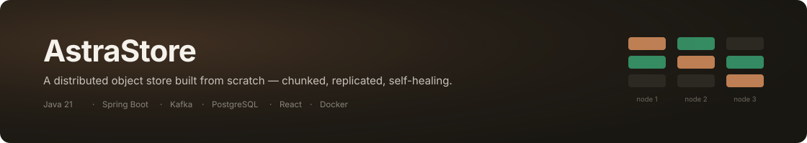
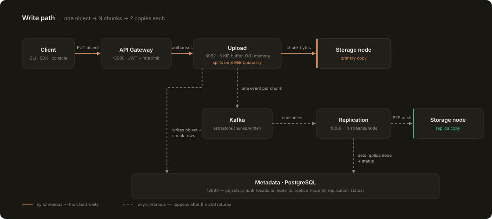
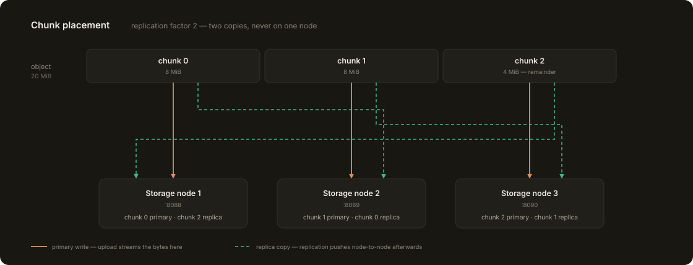
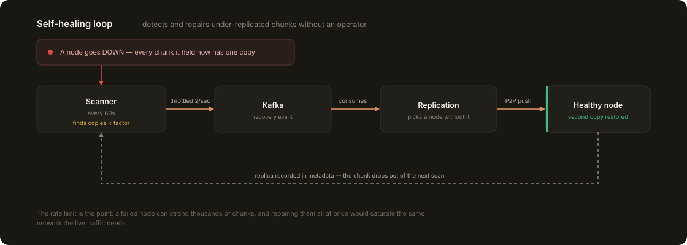

<p align="center">
  
</p>

# AstraStore

An S3-style distributed object store, written from the ground up. Files are split
into chunks, streamed to storage nodes in constant memory, replicated node-to-node,
and repaired automatically when a node goes away.

It is a real distributed system rather than a wrapper over one: the chunking,
placement, replication, health tracking and repair are all implemented here.

---

## How a write works

<p align="center">
  
</p>

The upload service never holds a file in memory. It reads through a fixed **8 KiB
buffer**, updating two SHA-256 digests as it goes — one for the current chunk, one
for the whole object — and cuts a new chunk every **8 MiB**. A 4 GB upload and a
4 KB upload use the same amount of RAM.

The client's request returns as soon as the primary copies are written and the
metadata rows are committed. Replication happens afterwards, off a Kafka event, so
a slow replica never slows down the caller.

## Where the chunks go

<p align="center">
  
</p>

The replication factor is **2** — each chunk exists on exactly two nodes, and never
twice on the same one. Placement round-robins across nodes the placement service
currently considers healthy, so chunks of one object spread out instead of piling
onto a single machine.

Every chunk's location is recorded in `metadata.chunk_locations`, and administrators
can see the whole map in the console: which node holds each chunk of an object, and
everything a given node is holding.

## When a node dies

<p align="center">
  
</p>

A heartbeat runs against every node every 10 seconds, and a state machine moves each
one through `HEALTHY → DEGRADED → DOWN → RECOVERING` (three consecutive failures to
fall, two successes to recover). Nodes that are not healthy stop receiving new chunks
immediately.

Repair is deliberately **rate limited to 2 chunks/second**. A node that drops can
strand thousands of chunks at one copy, and repairing them as fast as possible would
saturate the same network the live traffic is using.

---

## Quick start

**Prerequisites** — Docker & Docker Compose, Java 21+, Gradle 9+

```bash
git clone https://github.com/Gokul-Nishandh/AstraStore.git
cd AstraStore
./gradlew clean build -x test
docker compose up -d
```

Give Postgres and Kafka ~30 seconds, then:

| Surface | URL |
|---|---|
| **Console** | http://localhost:5173 |
| API Gateway | http://localhost:8080 |
| Grafana | http://localhost:3000 |
| Jaeger | http://localhost:16686 |
| Prometheus | http://localhost:9090 |

```bash
docker compose ps                              # all services healthy?
curl http://localhost:8080/actuator/health     # gateway
curl http://localhost:8088/api/v1/health/heartbeat   # storage node 1
```

The first account you register is a normal user. To make yourself an administrator,
set `ASTRASTORE_ADMIN_EMAILS` before starting — matching accounts are promoted on
startup.

---

## Using the API

Everything below goes through the gateway on `:8080`. **Every endpoint except
register, login and password reset requires a bearer token.**

### Sign in

```bash
curl -X POST http://localhost:8080/api/auth/register \
  -H "Content-Type: application/json" \
  -d '{"username":"alice","email":"alice@example.com","password":"CorrectHorse!23"}'

curl -X POST http://localhost:8080/api/auth/login \
  -H "Content-Type: application/json" \
  -d '{"email":"alice@example.com","password":"CorrectHorse!23"}'
# → { "token": "eyJ...", "refreshToken": "...", "roles": ["USER"] }
```

### Buckets and objects

```bash
TOKEN=eyJ...

# create a bucket
curl -X POST http://localhost:8080/api/v1/buckets \
  -H "Authorization: Bearer $TOKEN" -H "Content-Type: application/json" \
  -d '{"name":"reports"}'

# upload — the object key is the path, the body is the bytes
curl -X PUT "http://localhost:8080/api/v1/buckets/$BUCKET_ID/objects/q3.pdf" \
  -H "Authorization: Bearer $TOKEN" -H "Content-Type: application/pdf" \
  --data-binary @q3.pdf

# download it back
curl -H "Authorization: Bearer $TOKEN" \
  "http://localhost:8080/api/v1/buckets/$BUCKET_ID/objects/q3.pdf" -o q3.pdf

# the metadata record, rather than the bytes
curl -H "Authorization: Bearer $TOKEN" -H "Accept: application/json" \
  "http://localhost:8080/api/v1/objects/$OBJECT_ID"
```

> `GET /api/v1/objects/{id}` means two different things. With
> `Accept: application/json` the metadata service returns the record; otherwise the
> download service returns the file. The gateway splits them on that header alone.

### Operations (ADMIN only)

```bash
curl -H "Authorization: Bearer $TOKEN" http://localhost:8080/api/v1/cluster/status

# where does each chunk of this object live?
curl -H "Authorization: Bearer $TOKEN" \
  "http://localhost:8080/api/v1/admin/objects/$OBJECT_ID/chunks"

# what is this node holding, as primary or replica?
curl -H "Authorization: Bearer $TOKEN" -G \
  --data-urlencode "nodeId=storage-node-1" \
  --data-urlencode "nodeId=http://storage-node-1:8088" \
  http://localhost:8080/api/v1/admin/chunks

curl -X POST -H "Authorization: Bearer $TOKEN" \
  http://localhost:8080/api/v1/admin/heal/run     # force a repair pass
```

> `nodeId` is repeatable because a node answers to two names: chunk rows record the
> base URL the download service fetches from, while the placement registry uses the
> short name. Pass both to see everything a node holds.

---

## The console

A React console ships with the stack at **http://localhost:5173** — buckets and
objects with upload, search, starring and trash; an account area with API keys and
an audit trail; and, for administrators, cluster health, per-node capacity, user
management, and the chunk placement views shown above.

It is built against a written design contract (`dashboard/DESIGN.md`). The rule that
shapes it most: **never invent a number.** The backend returns `null` for "not enough
data yet", and the UI renders an em dash rather than a confident zero — a fresh
cluster does not get to claim 100% uptime or a capacity no disk has.

---

## Services

| Service | Port | Responsibility |
|---|---|---|
| `api-gateway` | 8080 | Routing, JWT verification, rate limiting, circuit breakers |
| `auth` | 8081 | Accounts, JWT + refresh tokens, API keys, roles, audit log |
| `upload` | 8082 | Zero-memory chunking, streams chunks to nodes |
| `download` | 8083 | Parallel chunk fetch, in-order reassembly, checksum verify |
| `metadata` | 8084 | Buckets, objects, chunk locations — the source of truth |
| `placement` | 8085 | Node registry, heartbeats, health state machine, node selection |
| `replication` | 8086 | P2P push, under-replication scanner, repair |
| `monitoring` | 8087 | Availability history and incidents |
| `storage-node` | 8088–8090 | Chunk storage on disk |
| `dashboard` | 5173 | React console |

### Storage node API

Internal only — never routed through the gateway.

| Method | Endpoint | Description |
|---|---|---|
| `POST` | `/api/v1/chunks/{id}` | Atomic write — temp file → `fsync` → atomic move |
| `GET` | `/api/v1/chunks/{id}` | Stream a chunk from disk |
| `DELETE` | `/api/v1/chunks/{id}` | Remove a chunk |
| `POST` | `/api/v1/replication/push` | P2P push to another node |
| `GET` | `/api/v1/health/heartbeat` | Health, disk usage, chunk count |

Chunks live at `/data/storage/<2-hex-prefix>/<chunkId>` — a 256-way fan-out created
at startup, so no single directory ever holds millions of entries.

---

## Design decisions worth knowing

**Zero-memory streaming.** One 8 KiB buffer, both digests updated in the same pass,
nothing staged to disk.

```java
byte[] buffer = new byte[8192];
while ((bytesRead = inputStream.read(buffer)) != -1) {
    chunkDigest.update(buffer, 0, bytesRead);
    objectDigest.update(buffer, 0, bytesRead);
    outputStream.write(buffer, 0, bytesRead);
}
```

**Atomic writes.** A chunk is written to a temp file, `fsync`'d, then moved into place
with `ATOMIC_MOVE`. A crash mid-write leaves a temp file, never a half-written chunk
that would pass a directory listing and fail a checksum.

**Integrity is checked, not assumed.** Every chunk carries a SHA-256 computed at write
time and verified on every read, and the whole object carries its own digest. A
round-tripped file matches byte for byte or the read fails.

**Cross-account access returns 404, never 403.** Confirming that someone else's object
exists is itself a disclosure, so an object you do not own is indistinguishable from
one that was never there.

**Two truths about capacity.** `rawBytesStored` is what is physically on disk;
`logicalBytesStored` is what users uploaded. At factor 2 a 1 GB object occupies 2 GB
of cluster. Both are reported, and always labelled.

---

## Team

| Name | Role | Module |
|---|---|---|
| Pranav Surya | Data Flow Lead | Module 1 — Metadata Engine & Gateway |
| Gokul Nishandh | System State Lead | Module 2 — Placement & Cluster Health |
| B T Senthan Amuthan | Infrastructure Lead | Module 3 — Distributed Storage Engine |
| Pranaav A | Security & DX Lead | Module 4 — Auth, SDKs & Monitoring |

| Module | Description |
|---|---|
| 1 — Metadata Engine & Gateway | PostgreSQL schema, upload/download orchestration, API gateway |
| 2 — Placement & Cluster Health | Placement strategy, node health state machine, monitoring |
| 3 — Distributed Storage Engine | Zero-memory chunker, storage node agent, replication, self-healing |
| 4 — Auth, SDKs & Monitoring | Auth service, Java/Python/Node SDKs, console |

---

## Project status

Working end to end: upload, download, replication, self-healing, auth with roles and
API keys, the console, and the CLI. Known gaps, kept here deliberately rather than
quietly:

- Chunks written before the replication factor was made configurable sit on all three
  nodes and need a reconciliation pass to drop the surplus copy.
- Downloads buffer the whole object in browser memory before the save dialog; the
  right fix is a short-lived pre-signed URL.
- Deleting an account removes credentials, keys and sessions and anonymises the audit
  trail, but does not yet erase stored objects.
- `metadata` test coverage is 47% against a 70% target.

---

## Development

```bash
./gradlew build -x :cli:test           # full build
./gradlew :metadata:test               # one module
./gradlew :cli:installDist             # build the astra CLI

cd dashboard && npm install
npx tsc -b --noEmit && npm run build   # console type check + build
```

Docker images package `<service>/build/libs/*.jar`, so run `./gradlew :<service>:bootJar`
before `docker compose build <service>` — otherwise the image ships the previous jar.
