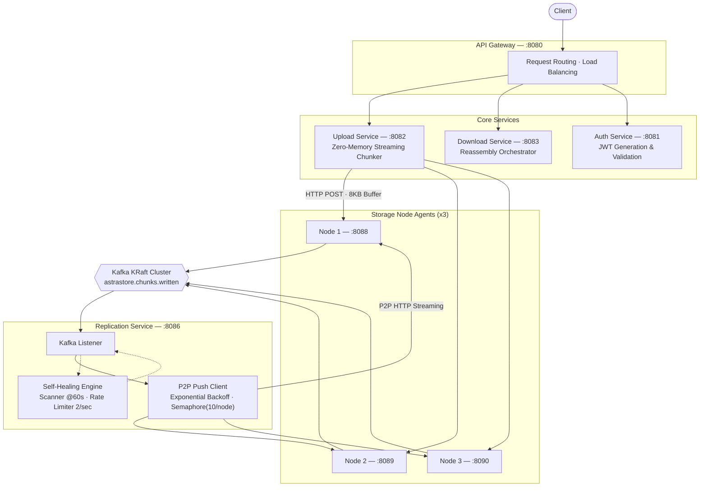
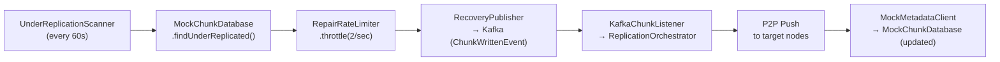

# AstraStore

**Distributed Storage Engine**

A production-grade distributed storage system inspired by Amazon S3, implementing zero-memory streaming, P2P replication, and self-healing data repair mechanisms.

---

## Architecture



Each storage node holds one primary chunk and two replicas, distributed round-robin across the cluster. Chunk files are stored on disk using a 256-way hex directory fan-out (`/data/chunks/00/ff/xxxxxx`).

### Storage Node API

| Method | Endpoint | Description |
|---|---|---|
| `POST` | `/api/v1/chunks/{id}` | Atomic write (temp → fsync → move) |
| `GET` | `/api/v1/chunks/{id}` | Stream chunk from disk |
| `DELETE` | `/api/v1/chunks/{id}` | Remove chunk file |
| `GET` | `/api/v1/health` | Heartbeat + disk status |

---

## Team

| Name | Role | Module |
|---|---|---|
| Pranav Surya | Data Flow Lead | Module 1 — Metadata Engine & Gateway |
| Gokul Nishandh | System State Lead | Module 2 — Placement & Cluster Health |
| B T Senthan Amuthan | Infrastructure Lead | Module 3 — Distributed Storage Engine |
| Pranaav A | Security & DX Lead | Module 4 — Auth, SDKs & Monitoring |

## Module Breakdown

| Module | Owner | Description |
|---|---|---|
| Module 1: Metadata Engine & Gateway | Pranav Surya | PostgreSQL schema, Upload/Download Orchestrator, API Gateway |
| Module 2: Placement & Cluster Health | Gokul Nishandh | Placement Strategy, Node Health State Machine, Monitoring |
| Module 3: Distributed Storage Engine | B T Senthan Amuthan | Zero-Memory Chunker, Storage Node Agent, Replication, Self-Healing |
| Module 4: Auth, SDKs & Monitoring | Pranaav A | Auth Service, Client SDKs, Monitoring Dashboard |

---

## Features

- **Zero-Memory Streaming** — O(1) memory footprint using an 8KB fixed buffer, handles files of any size
- **Dual SHA-256 Digests** — Per-chunk and whole-object hashing without staging to disk
- **Atomic Writes** — Temp file → fsync → atomic move for crash-safe storage
- **P2P Replication** — Direct node-to-node streaming with Kafka coordination
- **Self-Healing** — Automatic detection and repair of under-replicated chunks
- **Exponential Backoff** — Network resilience with retry logic (1s → 2s → 4s)
- **Concurrency Limits** — Semaphore-based throttling (10 concurrent streams per node)

---

## Quick Start

### Prerequisites

- Docker & Docker Compose
- Java 21+
- Gradle 9+

### 1. Clone & Build

```bash
git clone https://github.com/Gokul-Nishandh/AstraStore.git
cd AstraStore
./gradlew clean build -x test
```

### 2. Start All Services

```bash
docker compose up -d
```

### 3. Verify Services

```bash
# Check all services
docker compose ps

# Health checks
curl http://localhost:8080/actuator/health   # API Gateway
curl http://localhost:8081/actuator/health   # Auth
curl http://localhost:8082/actuator/health   # Upload
curl http://localhost:8086/actuator/health   # Replication
curl http://localhost:8088/api/v1/health/heartbeat   # Storage Node 1
curl http://localhost:8089/api/v1/health/heartbeat   # Storage Node 2
curl http://localhost:8090/api/v1/health/heartbeat   # Storage Node 3
```

---

## Testing APIs

### Upload a File

```bash
# Via API Gateway
curl -X POST http://localhost:8080/api/v1/upload \
  -F "file=@/path/to/file.bin"

# Response
{
  "globalHash": "abc123...",
  "totalChunks": 2,
  "chunks": [
    {"chunkId": "...", "nodeIp": "http://storage-node-1:8088", "checksum": "..."}
  ]
}
```

### Verify Replication (All 3 Nodes)

```bash
curl http://localhost:8088/api/v1/chunks/{chunkId}
curl http://localhost:8089/api/v1/chunks/{chunkId}
curl http://localhost:8090/api/v1/chunks/{chunkId}
```

### Self-Healing Test

```bash
# 1. Register chunk for tracking
curl -X POST http://localhost:8086/api/v1/admin/metadata/register \
  -H "Content-Type: application/json" \
  -d '{
    "chunkId": "YOUR-CHUNK-ID",
    "sizeBytes": 1024,
    "checksum": "abc123...",
    "targetReplicas": 3,
    "replicaNodes": [
      "http://storage-node-1:8088",
      "http://storage-node-2:8088",
      "http://storage-node-3:8088"
    ]
  }'

# 2. Simulate node failure (drop 1 replica)
curl -X POST http://localhost:8086/api/v1/admin/chaos/kill-node \
  -H "Content-Type: application/json" \
  -d '{"chunkId": "YOUR-CHUNK-ID", "replicasToDrop": 1}'

# 3. Trigger healing (or wait 60s for auto-scan)
curl -X POST http://localhost:8086/api/v1/admin/heal/run

# 4. Verify healed
curl http://localhost:8086/api/v1/admin/metadata/status
# Expected: {"underReplicatedChunks":0, ...}
```

### Auth Service

```bash
# Register
curl -X POST http://localhost:8081/api/auth/register \
  -H "Content-Type: application/json" \
  -d '{"username":"user","password":"password123","email":"user@test.com"}'

# Login
curl -X POST http://localhost:8081/api/auth/login \
  -H "Content-Type: application/json" \
  -d '{"username":"user","password":"password123","email":"user@test.com"}'
```

---

## Key Technical Decisions

### Zero-Memory Streaming

```java
// 8KB fixed buffer - memory never grows regardless of file size
byte[] buffer = new byte[8192];
while ((bytesRead = inputStream.read(buffer)) != -1) {
    chunkDigest.update(buffer, 0, bytesRead);
    objectDigest.update(buffer, 0, bytesRead);
    outputStream.write(buffer, 0, bytesRead);
}
```

### Atomic Writes

```java
// 1. Write to temp file
// 2. fsync to disk
// 3. Atomic rename to final location
Files.write(tempPath, data);
tempPath.toFile().setWritable(true);
FileOutputStream fos = new FileOutputStream(tempPath.toFile());
fos.getFD().sync();
Files.move(tempPath, finalPath, StandardCopyOption.ATOMIC_MOVE);
```

### Self-Healing Loop



---
